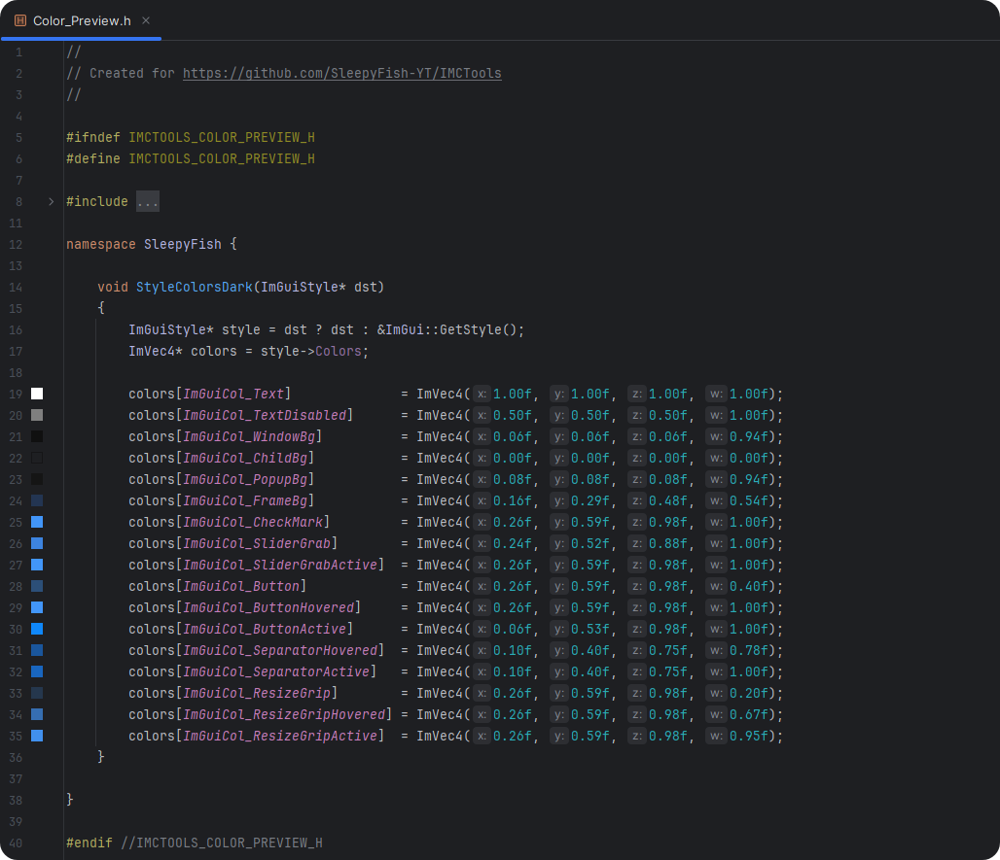
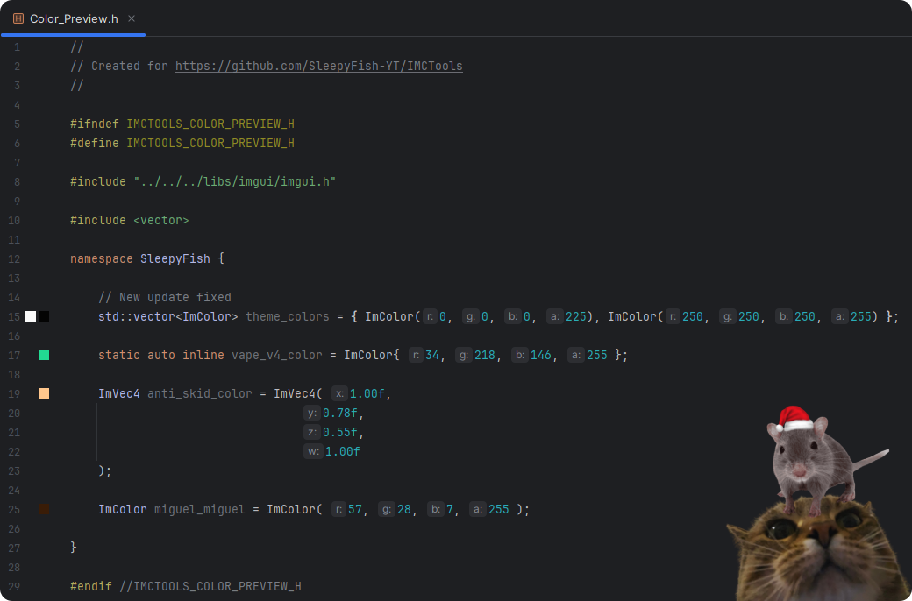

#  ImGui Productivity Tools - IMCTools
### **Turbocharge your Dear ImGui workflow with smart color editing + auto-formatting!**
###### This plugin is made on the IntelliJ Platform Example from JetBrains.

# Features

## Visual Color Picker
Click gutter icons to modify colors directly in your code
Supports all ImGui color formats:
  ```java
  ImColor color = ImColor(255, 0, 0, 167);            // Integer
  ImVec4 color = ImVec4(1.00f, 0.50f, 0.00f, 1.00f);  // Float
  float color[4] = {0.20f, 0.20f, 0.20f, 1.00f};      // Array
  ```
Updated buggy find usage. Now this also will work:
  ```java
  auto color = ImColor(255, 0, 0);                                                // Integer
  ImVec4 color{0.43f, 0.21f, 0.71f, 1.00f};                                       // Float
  float color[4]{0.22f, 0.22f, 0.29f, 1.00f};                                     // Array
  std::vector<ImColor> cols{ImColor(250, 250, 250, 255), ImColor{0, 0, 0, 255}};  // Vector
  ```

### Examples:
### *Same color picker we all love from IntelliJ IDE when working with `jawa.awt.Color`*



## Smart Code Formatting
Automatic line breaks for ImGui blocks:
- Proper indentation for widget hierarchies
- Formatting preserves your code style

This code:
```groovy
ImGui::Begin("Window"); {user_enter}
```
Will be automatically formatted to this:
```groovy
ImGui::Begin("Window");
{
  {user_cursor_will_be_set_here}
}
ImGui::End();
```

## Installation
Marketplace: Not Uploaded yet.
Manual:
1. Download the .jar from [releases](https://github.com/SleepyFish-YT/IMCTools/releases/latest)
2. Open [JetBrains CLion](https://www.jetbrains.com/clion/)
3. Go in your plugins window
4. Press the gear icon and select "Install plugin from Disk..."
5. Select the .jar
#### More information about installation can be found [here](https://www.jetbrains.com/help/idea/managing-plugins.html#install_plugin_from_disk)

## Compatibility
- Primary IDE: **CLion `<= 2023.3 (233)`** (other JetBrains IDEs may work)
- Languages: C/C++
- ImGui Versions: Works with all Dear ImGui versions

## TODO:
- [X] Fix the color picker 
- [ ] Add Customization for the [Smart Code Formatting](#smart-code-formatting)


###### Signed by SleepyFish.
